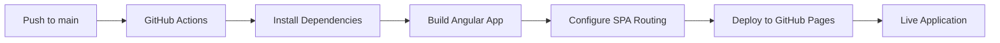

# CicdNew3 - Angular CI/CD Project

[](https://github.com/AishwaryaKulkarni1801/cicdNew3/actions/workflows/deploy.yml)

This project was generated with [Angular CLI](https://github.com/angular/angular-cli) version 16.2.16 and includes a complete CI/CD pipeline for automated deployment to GitHub Pages.

## 🚀 Live Demo

The application is automatically deployed to GitHub Pages: [https://aishwaryakulkarni1801.github.io/cicdNew3/](https://aishwaryakulkarni1801.github.io/cicdNew3/)

## 📋 Table of Contents

- [Project Overview](#project-overview)
- [CI/CD Pipeline](#cicd-pipeline)
- [Development Setup](#development-setup)
- [Deployment](#deployment)
- [Monitoring & Troubleshooting](#monitoring--troubleshooting)
- [Contributing](#contributing)

## 🎯 Project Overview

This Angular application demonstrates a complete CI/CD workflow with:
- ✅ Automated testing and building
- ✅ GitHub Pages deployment
- ✅ Environment-specific configurations
- ✅ SPA routing support with 404 fallback

## 🔄 CI/CD Pipeline

### Workflow Overview

The CI/CD pipeline is implemented using **GitHub Actions** and automatically:

1. **Triggers** on every push to the `main` branch
2. **Builds** the Angular application with production optimizations
3. **Tests** the application (when tests are configured)
4. **Deploys** to GitHub Pages with proper SPA routing
5. **Monitors** deployment status and provides live URLs

### Pipeline Architecture



### Workflow Configuration

**File Location:** `.github/workflows/deploy.yml`

**Key Features:**
- **Node.js 18** environment
- **NPM caching** for faster builds
- **Automatic base-href** configuration
- **SPA routing** with 404.html fallback
- **Environment tracking** (`uat-environment`)
- **Manual deployment** trigger support

### Deployment Environments

| Environment | Branch | URL | Purpose |
|-------------|--------|-----|---------|
| UAT | `main` | [GitHub Pages URL] | User Acceptance Testing |

## 🛠️ Development Setup

### Prerequisites

- **Node.js** 18.x or higher
- **npm** 8.x or higher
- **Angular CLI** 16.x

### Local Development

1. **Clone the repository:**
   ```bash
   git clone https://github.com/AishwaryaKulkarni1801/cicdNew3.git
   cd cicdNew3
   ```

2. **Install dependencies:**
   ```bash
   npm install
   ```

3. **Start development server:**
   ```bash
   npm start
   # or
   ng serve
   ```

4. **Open application:**
   Navigate to `http://localhost:4200/`

### Available Scripts

| Command | Description |
|---------|-------------|
| `npm start` | Start development server |
| `npm run build` | Build for production |
| `npm test` | Run unit tests |
| `npm run watch` | Build in watch mode |

### Code Scaffolding

Generate new components, services, and other Angular elements:

```bash
ng generate component component-name
ng generate service service-name
ng generate module module-name
```

## 🚢 Deployment

### Automatic Deployment

**Every push to `main` branch triggers automatic deployment:**

1. ✅ Code is pushed to `main` branch
2. ✅ GitHub Actions workflow starts
3. ✅ Dependencies are installed with `npm ci`
4. ✅ Application is built with production configuration
5. ✅ Build artifacts are uploaded to GitHub Pages
6. ✅ Live URL is available in the Actions summary

### Manual Deployment

**Trigger deployment manually from GitHub Actions tab:**

1. Go to **Actions** tab in GitHub repository
2. Select **"Deploy to GitHub Pages"** workflow
3. Click **"Run workflow"**
4. Select `main` branch and click **"Run workflow"**

### Deployment Configuration

```yaml
# Build with correct base href for GitHub Pages
npm run build -- --base-href "/cicdNew3/"

# SPA routing support
cp dist/cicd-new3/index.html dist/cicd-new3/404.html
```

### Environment Variables

The workflow automatically configures:
- **Repository name** from GitHub context
- **Base href** for proper asset loading
- **Output path** from `angular.json` configuration

## 📊 Monitoring & Troubleshooting

### Build Status

Monitor deployment status:
- **GitHub Actions tab:** View real-time build logs
- **Repository badges:** Quick status overview
- **Environment tab:** Track deployment history

### Common Issues & Solutions

| Issue | Solution |
|-------|----------|
| **404 on page refresh** | ✅ Handled by 404.html fallback |
| **Assets not loading** | ✅ Automatic base-href configuration |
| **Build failures** | Check Actions logs for detailed errors |
| **Permission errors** | Verify GitHub Pages settings |

### Debugging Steps

1. **Check GitHub Actions logs:**
   - Go to Actions tab → Latest workflow run
   - Expand failed steps for detailed logs

2. **Verify GitHub Pages settings:**
   - Repository Settings → Pages
   - Source should be "GitHub Actions"

3. **Test locally:**
   ```bash
   npm run build -- --base-href "/cicdNew3/"
   # Serve dist folder to test production build
   ```

### Performance Monitoring

- **Bundle analysis:** Check build logs for bundle sizes
- **Build time:** Monitor workflow execution time
- **Dependencies:** Regular security and update checks

## 👥 Contributing

### Development Workflow

1. **Create feature branch:**
   ```bash
   git checkout -b feature/your-feature-name
   ```

2. **Make changes and test locally:**
   ```bash
   npm start
   npm test
   ```

3. **Commit and push:**
   ```bash
   git add .
   git commit -m "feat: your feature description"
   git push origin feature/your-feature-name
   ```

4. **Create Pull Request:**
   - Target: `main` branch
   - Include description of changes
   - Wait for CI checks to pass

### Code Standards

- **TypeScript strict mode** enabled
- **Angular style guide** compliance
- **Automated testing** for new features
- **Meaningful commit messages** following conventional commits

### Testing Strategy

```bash
# Unit tests
npm test

# Build verification
npm run build

# Local production testing
npm run build -- --base-href "/cicdNew3/"
```

## 📚 Additional Resources

- [Angular CLI Documentation](https://angular.io/cli)
- [GitHub Actions Documentation](https://docs.github.com/en/actions)
- [GitHub Pages Documentation](https://docs.github.com/en/pages)
- [Angular Deployment Guide](https://angular.io/guide/deployment)

## 📝 License

This project is open source and available under the [MIT License](LICENSE).

---

**Generated with ❤️ using Angular CLI and automated with GitHub Actions**
